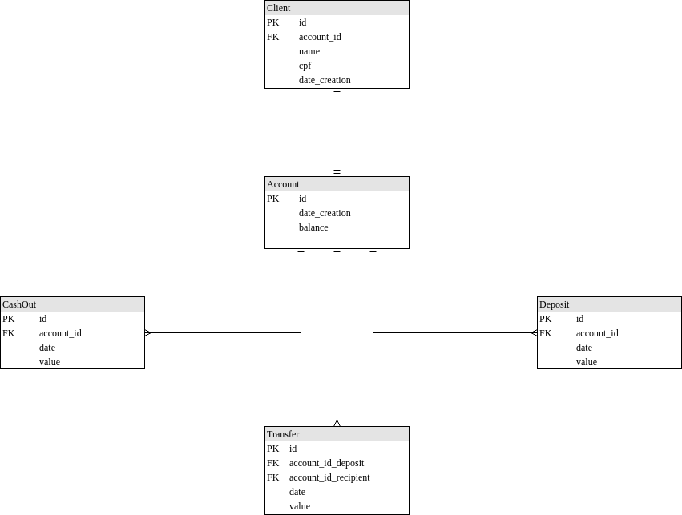

# POC bank (Java)

É uma aplicação que simula o sistema um banco, permite o cadastro de clientes, e as operações de depósitos, saque, tranferência, consulta de saldo e extrato da conta. Foi utilizada a linguagem Java para o desenvolvimento do codigo, Postgres para o gerenciamento do banco de dados, Maven para o gerenciamento das dependências e a inicializaçõa é feita com o framework Spring boot.

## Regras de Negócio:

- O saldo da conta nunca poderá ser negativo;
- Não pode ser possível realizar saque ou transferência quando o saldo na conta é
insuficiente;
- A conta de destino deve ser válida;
- O cliente só poderá ter uma conta (validar por CPF por exemplo);
- Ao criar a conta na resposta de sucesso deverá constar o Id da conta para futuras movimentações;
- Ao solicitar um extrato, deverá constar toda movimentação da conta, como
transferência, depósito e saque;
- Ao solicitar transferência tanto a conta de destino quanto a de origem devem ser
válidas;
- Não pode ser possível realizar uma transferência para você mesmo, ou seja, conta de origem não pode ser igual a conta de destino;

## DER



## Requisitos para executar a aplicação

A aplicação depende de algumas tecnologias para a execução como:
- Java JDK
- Maven
- Docker
- Docker-Compose
- PostgreSQL

Após a instalação das dependencias atraves do terminal na pasta raiz do projeto execute o comando:
```sh $ mvn clean install```
Depois digite a instrução abaixo para a alocar o container com o banco de dados:
```sh $ docker-compose up```
Aṕos o passo anterior deve iniciar a aplicação na IDE.

Será possivel testar a aplicação pelo endereço:
```sh $ localhost:8080/```

### EndPoints:

#### EndPoints "/client"

Serviço | Endereço | Parâmetro
------------ | ------------- | ------------- 
Novo Cliente | localhost:8080/client/create | {"name": "Fulano de Tal", "cpf": "111.111.111-11"}
Consultar Cliente | localhost:8080/client/{id conta} |
Editar Cliente | localhost:8080/client/update/{id conta} | {"name": "Fulano de Tal", "cpf": "111.111.111-11"}

#### EndPoints "/operation"

Serviço | Método | Endereço | Parâmetro
------------ | ------------ | ------------- | ------------- 
Saldo | GET | localhost:8080/operation/balance/{id conta} | 
Deposito | POST | localhost:8080/operation/deposit | {"accountId": 1,"value": 500}
Saque | POST | localhost:8080/operation/cashout | {"accountId": 2,"value": 140}
Transferência | POST | localhost:8080/operation/transfer | {"depositAccountid": 1, ,"recipientAccountid": 2, "value": 50.00}
Extrato | GET | localhost:8080/operation/accountStatement/{accountId} |
